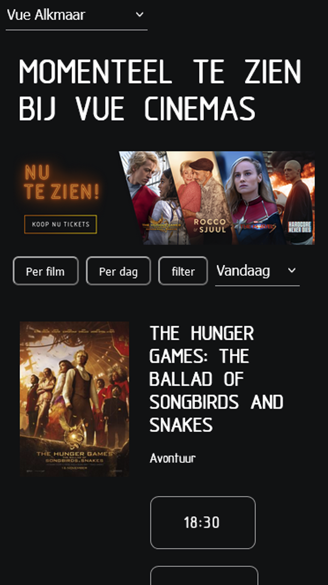
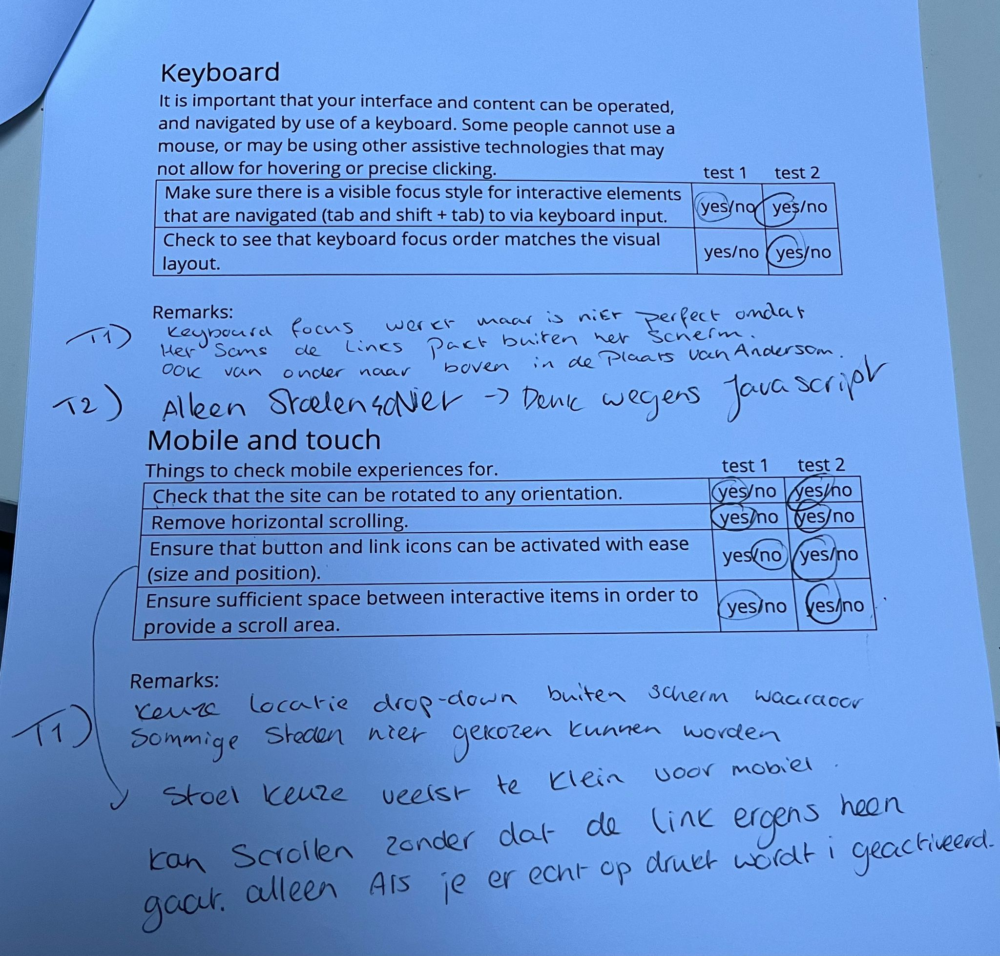

# Procesverslag
Markdown is een simpele manier om HTML te schrijven.  
Markdown cheat cheet: [Hulp bij het schrijven van Markdown](https://github.com/adam-p/markdown-here/wiki/Markdown-Cheatsheet).

Nb. De standaardstructuur en de spartaanse opmaak van de README.md zijn helemaal prima. Het gaat om de inhoud van je procesverslag. Besteedt de tijd voor pracht en praal aan je website.

Nb. Door *open* toe te voegen aan een *details* element kun je deze standaard open zetten. Fijn om dat steeds voor de relevante stuk(ken) te doen.

## Jij

  
uitwerken voor kick-off werkgroep

  ### Auteur:
  Dian Dikhout

  #### Je startniveau:
  Rode piste

  #### Je focus:
  Surface plane:
  - dark/light mode
  - SVG + scroll animatie
  - Animaties
  - Prefers-reduced-motion
  - Custom theme: Kerst

 

## Je website

  
uitwerken voor kick-off werkgroep

  ### Je opdracht:
  De website die ik ga namaken is Vue cinemas    https://www.vuecinemas.nl/films/nu-in-de-bioscoop#filmposters
  Ik heb gekozen voor de overzichtpagina van de films die afspelen op 1 dag en dan in een stad. De tweede pagina is het kiezen van stoelen bij het bestellen van kaartjes.

  #### Screenshot(s) van de eerste pagina (small screen): 
  Overzicht van de films die draaien in de bioscoop op 1 locatie:
  

  #### Screenshot(s) van de tweede pagina (small screen):
  Zitplaatsen kiezen
  

## Toegankelijkheidstest 1/2 (week 1)

  
uitwerken na test in 2e werkgroep

  ### Bevindingen
  Lijst met je bevindingen die in de test naar voren kwamen:
  Wat mij is opgevallen is dat je niet gemakkelijk de bestelling kan annuleren bij Vue.

  Slechtzienden:
  Grijzen teksten of icoontjes op een zwarte achtergrond van de website zie je niet goed als je slechtziend bent, bijvoorbeeld met vlekken voor je ogen. Witte tekst op gele button is ook amper te lezen. De teksten moeten niet te klein zijn. De stoelen die bezet zijn zijn niet zichtbaar en vallen weg met de achtergrond. Het lijkt dus alsof de stoelen kaart niet compleet is. Aan de ene kant is dit handig omdat de bezoekers er toch niet op kunnen klikken wegens reservering maar het kan wel fijn zijn voor slechtzienden om te weten dat er wel stoelen tussen zitten en verduidelijking hebben dat ze bezet zijn. Zij zoudenmisschien juist wel daar n het midden willen zitten.

  Gele bril: 
  De kleuren groen en blauw is niet meer te onderscheiden (stoel keuze). Ze veranderen alle twee in dezelfde kleur.

  Verteller op windows:
  De website leest van boven naar beneden. Het heeft aan de bovenkant een pop-up dat je kan sluiten. Als die niet is afgesloten dan kan ik niet naar een volgende kop omdat die niet volgens verteller bestaat.
  De overszichts pagina van de films die afspelen op een dag worden gezien als een heading maar daar neemt hij ook gelijk de sub kopjes en tijden mee van de buttons. Ook zegt hij 1 van 16 in de plaats van heading 1. Het is trouwens een H2 in de code.
  Flim pagina leest hij de tijden van de buttons wel op maar zegt niet de dag. Dit gebeurt ook als ik met de pijlen alleen navigeer en niet alleen de links. Verder als ik met de pijl keys navigeer voor tijden van 1 film dan gaat hij van beneden naar boven en moet ik eerst alle links van de voeter langs.
  De Engelse tekst, terwijl het in het Nederlands word voorgelezen, klinkt niet juist en is erg verwarrend. Vooral de film titels. Je weet niet goed wat er voorgelezen wordt. Veel films hebben een Engelse titel. Dus misschien een alt tekst met titels in het nederlands?

  Zie de resultaten van de WCAG checklist bij de toegankelijkheids test in week 4.

## Breakdownschets (week 1)

  
uitwerken na afloop 3e werkgroep

  ### de hele pagina met dynamisch delen: 
  Dit is de breakdown van de film lijst/overzicht pagina van vue:
  Ik heb die van de film ticket/stoelkeuze nog niet gedaan. Ik doe deze nadat ik mijn html van de overzichtspagina heb staan en begin daar gelijk aan zonder echt een breakdown te schetsen. Het kost namelijk nogal veel tijd om dit te doen en ik kan goed de overzichts pagina als voorbeeld gebruiken.
  

## Voortgang 1 (week 2)

  
uitwerken voor 1e voortgang

  ### Stand van zaken
  Met het opbouwen van de website ben ik eerst begonnen met alle content in de html te zetten van beide pagina's. Nadat dat klaar was bn ik pas begonnen met het opmaken van de site met css. Ik ben begonnen met de film lijst. Wel heb ik al alle html staan met de justie codes (als het goed is).

  Het duurde een tijd voordat ik de foto van de film en de titel + de links van de tijden naast elkaar kreeg. Ik ben er uiteindelijk achter gekomen dat ik ze apart in een section moest zetten en door middel van flexbox en grid ze naast elkaar heb gekregen. Nu heb ik alleen het probleem dat niet alle titels gelijk naast de film poster heb staan. Er zitten rare tabs in (zie foto). 
  

  Doordat ik ben gaan vormgeven met mobile first ziet het er wel goed uit op iPhone 8 formaat maar website formaat werdt alles op elkaar gecompressed.  
   
  

 
  ### Agenda voor meeting
  samen met je groepje opstellen

  | Dian Dikhout    | Famke Mulder    | Quinty Caspers  | Niels       |
 - We hebben niet echt gezamelijk iets waar we hulp nodig voor hebben.

 Persoonlijk:
 - film lijst heeft rare tabs

  ### Verslag van meeting
  hier na afloop snel de uitkomsten van de meeting vastleggen

  - De tabs look kwam doordat ik niet had aangegeven wat voor colomn het was (grid-template-columns: auto 1fr;).
  - Ik moet nog de javascript opdracht doen. Deze is belangrijk en hoor ik te snappen voor bijvoorbeeld het hamburgermenu.
  - Ik loop blijkbaar voor met de opdracht. Ik hoefde alleen de html af te hebben en het hoefde nog niet vormgegeven te zijn met css. Het belangrijkst was dat ik alle opdrachten had gedaan zodat ik de code snap.

 Het bleek dus dat ik niet had aangegeven op welke column de list item moest beginnen. Dit heb ik nu wel aangegeven in de css bij de li met grid-column-start: 1;. Dit zet nu ook op groter scherm formaat de films onder elkaar.  
  

## Voortgang 2 (week 3)

  
uitwerken voor 2e voortgang

  ### Stand van zaken
  Ik heb een hamburger menu gemaakt met javascript en css en ziet er ook goed uit aleen hierdoor is mijn footer wel verdwenen. Voor de rest ben ik nog niet echt tegen dingen aangekomen. Ik weet alleen niet hoe ik moet beginnen met het maken van een stoelen kaart voor de film waar je ook op kan klikken.

  De styling van mij pagina gaat aan de andere kant goed. Ik ben bijna daarmee klaar waardoor ik snel kan gaan beginnen aan de animaties, themas, states etc.

  ### Agenda voor meeting
  samen met je groepje opstellen: we hebben allemaal zelf losse vragen van elkaar af.

  | Dian     
  - Scroll horizontaal werkt niet. Alleen verticaal.
  - Footer van de overzichts pagina verdwenen. Hoe kan je aleen de navigatie aanspreken op 1 pagina en die in de header staat?
  - Hoe kan ik het best de stoelen van de zaal maken zodat je er ook nog op kan klikken?
  - Hoe kan ik een dropdown maken voor meer informatie?

  ### Verslag van meeting
  hier na afloop snel de uitkomsten van de meeting vastleggen

  - Er staat een flexbox op de section en ik geef een width aan van 100% dat meestal juist goed is maar in dit geval wil ik m buiten de pagina hebben dus kan ik het beter aanspreken met em of pixels.
  - De navigatie moet ik specifieker aanspreken in de css en javascript. Zelf ben ik erachter gekomen dat ik in de css body:not(.ticket) kan zetten waardoor dejavascript code de navigatie op de ticket pagina niet pakt.
  - Donna (de studenten assistent) deelt met mij een specifieke code met javascript dat afbeeldingen automatisch dubliceerd. Met css moet ik dan alleen de plaatsing aangeven. anders is het t verstandigst om het gewoon 1 afbeelding van te maken.
  - Voor de dropdown heb je de html code 'details' die ik hier gemakkelijk voor kan gebruiken.

## Toegankelijkheidstest 2/2 (week 4)

  
uitwerken na test in 9e werkgroep

  ### Bevindingen
  De tab werkt anders in de screen reader dan bij selecteren van de headers. Ook leest hij alles gelijk door in die sectie. Dit is een feature in de screen reader. Verder werkt mijn tabs naar linkjes wel in google chrome maar de rest van de toetsen niet. In Firefox werkt het wel (voorlezen van de h1, links en doorheen gaan met pijltjes) maar deze leest hij voor terwijl ze achter het sticky menu staan. Voor blinden die de reader gebruiken is dit niet heel erg.

  Verder leest hij wel alle links dubbel op. Dit betekend de text die erin staat en de volledige browser link. Waarom? geen idee. 
  Het is nu twee dagen erna en ik weet hoe het komt: ik ben de alt vergeten :|.

  verder heb ik de volgende resultaten van de WCAG checklist (1e test en 2e test):
  
  
  
  
  

  Verder heb ik mijn focus states en hover state getest bij mijn vader hij is namelijk kleurenblind en ik had een dun randje grijs border gebruikt en hij zag deze amper. Daarna veranderd naar wit maar dit was nog steeds te dun dus heb ik ze dik en dashed gemaakt zodat het nog duidelijker werd.

## Voortgang 3 (week 4)

  
uitwerken voor 3e voortgang

  ### Stand van zaken
  Ik had eindelijk een kaart voor de stoelen gemaakt met javascript alleen deze zijn niet klikbaar. Ik weet nu niet of ik de imgs er los in moet zetten met een a eromheen en dat de img verandert als er op wordt geklikt via javascript of niet. Dit ga ik vragen bij het gesprek wat de beste manier is. Ook lukt het mij niet om een pijl te zetten aan de rechter kant van de pagina voor details en de sections onder summary naast elkaar te zetten. Ik heb grid en flexbox geprobeerd.
  Verder probeer ik een kerst thema toe te voegen aan de pagina als er op de button wordt geklikt en probeer dit via een mediaquery maar dit werkt helaas niet. Ik weet nu niet of ik nou een class moet toevoegen via javascript aan de body met een klik of niet. Misschien is er wel een andere manier.

  ### Agenda voor meeting

  Ik dacht misschien heeft iedereen wel wat aan hoe je een thema toevoegd aan de hand van een klik. En als zij ook details gebruiken op hun site hoe ze de pijl het best kunnen stylen en op een plaats krijgt zoals jij maar wilt. Ik denk dat iedereen wel hier iets aan heeft.

  ### Verslag van meeting
  Hier na afloop snel de uitkomsten van de meeting vastleggen

  - Kerst thema toevoegen aan de hand van javascript die een class toevoegd aan de pagina.
  - Voor de kaart kan ik aan de hand van input checkbox een kaar bouwen en stylen met checked, not(:checked), disabled, nth of type etc.
  - Voor de details gebruik ::after en/of ::before waarin je content: 'x'; kan stoppen. Zou ook nog met [open] de content aan kunnen passen.
  - Ik kan een div toevoegen aan de hidden context in de details om het te stylen als ik dat wil. Dit wilde ik niet waardoor ik als een nerd naar mijn site most kijken en kwam samen met Vasilis op de description list omdat er informatie over de film wordt gegeven waarin ik de dt en dd in gebruik.

## Eindgesprek (week 5)

  
uitwerken voor eindgesprek

  ### Je uitkomst - karakteristiek screenshots:
  Ik ben heel blij met de stoelenkaart die ik heb gemaakt met input checkbox.
  

  ### Dit ging goed/Heb ik geleerd: 
  Ik heb het volgende geleerd bij dit vak:

  1. Het maken van animaties met keyframes in css. Ik moest eerst wel heel erg inkomen en het ging niet altijd goed maar op het moment dat het was gelukt was ik er erg blij mee (een springende kerstman en de link/button die bounced als je erop klikt):
  
    

  2. Ik heb in dit vak geleerd hoe ik een stoelen kaart zou kunnen bouwen met input checkbox:
   
  
  3. Dat ik verschillende themas kan toevoegen en instellen op mijn site met @media en classes/javascript:
   
   
    

  4. Hoe ik een svg moet toevoegen aan mijn website pagina, hoe ik deze stijl en kan laten verschijnen op de pagina aan de hand van scrollen (met javascript en css). In de html moet ik de svg tag zetten waarin het pad gedefineerd word. Deze kan ik makkelijk aanvragen via illustrator als ik hem opsla als svg:
    
    
    

  ### Dit was lastig/Is niet gelukt:
  Wat mij helaas niet is gelukt is dat de svg alleen te zien is als de kerstthema is geactiveerd. Ik wist eccht niet waar ik moest beginnen omdat de svg in de html code moest staan. Ik dacht misschien via javascript dat ik zeg dat de svg is hidden als de body geen .christmas class heeft. Maar na zoeken voor een code via het internet kwam ik langs vanalles behalve dat wat ik wilde. Na 3 uurtjes heb ik mij er mij bij neergelegd. Je ziet de svg nu dus ook zonder het kerst thema op de pagina.
  

  Verder is het mij niet gelukt dat elke stoel van de stoelenmap een laser schiet van achter de stoel zelf als je de stoel selecteerd/klikt. Ik moest dan elke laser per stoel positioneren. Dit werdt mij ff te gek. Hierdoor komt er nu alleen een laser over het scherm tevoorschijn als je een VIP stoel selecteerd. Het enige probleem dat ik nu nog heb is dat als er 1 geselecteerd is en ik een tweede aanklik dan komt er niet nog een laser over het scherm. Dit komt doordat ik heb gezegt dat de animatie maar 1 keer moet afspelen omdat de gebruiker anders gek wordt als de laser maar heen en weer blijft gaan. Ik kon hier niet een oplossing voor vinden helaas.
  
  

## Bronnenlijst

  
continu bijhouden terwijl je werkt

  Nb. Wees specifiek ('css-tricks' als bron is bijv. niet specifiek genoeg). 
  Nb. ChatGpT en andere AI horen er ook bij.
  Nb. Vermeld de bronnen ook in je code.

  1. hamburger menu svg afbeelding: https://en.wikipedia.org/wiki/File:Hamburger_icon.svg
  2. Code hamburger menu: Sanne > https://codepen.io/shooft/pen/ZEVYyMQ
  3. Border-image met een gradient: https://www.digitalocean.com/community/tutorials/css-gradient-borders-pure-css & https://developer.mozilla.org/en-US/docs/Web/CSS/border-image
  4. ::after summary, hoe ik de pijl kan verplaatsen:  Vasilis van Gemert & https://developer.mozilla.org/en-US/docs/Web/CSS/::after*/
  5. kerstboom svg afbeelding bron (geen code): https://www.google.com/url?sa=i&url=https%3A%2F%2Fwww.svgheart.com%2Fproduct%2Fswirly-christmas-tree-with-star-holiday-svg-file%2F&psig=AOvVaw1jagVSV82LzBDUU4C5GF8m&ust=1702187443844000&source=images&cd=vfe&opi=89978449&ved=0CBEQjRxqFwoTCLDgzsfUgYMDFQAAAAAdAAAAABAI 
  6. gif sneeuw bron (geen code): https://www.google.com/url?sa=i&url=https%3A%2F%2Fnl.picmix.com%2Fstamp%2Fsnow-gif-flocons-de-neige-1385622&psig=AOvVaw1Y-c1MrRhLUUPMdRXifNCJ&ust=1702139074329000&source=images&cd=vfe&opi=89978449&ved=0CBEQjRxqFwoTCOil66OigIMDFQAAAAAdAAAAABAD
  7. svg snowflake (geen code): https://www.google.com/url?sa=i&url=https%3A%2F%2Fcommons.wikimedia.org%2Fwiki%2FFile%3AScandinavian_Snowflake.svg&psig=AOvVaw3w19oW1wPiZWl2KLvvdzRd&ust=1702228185927000&source=images&cd=vfe&opi=89978449&ved=0CBEQjRxqFwoTCJCl96PsgoMDFQAAAAAdAAAAABAD 
  8. svg animatie code en scroll: https://codepen.io/designcourse/pen/VwdgYZL & https://www.youtube.com/watch?v=H_7Ld5Psgg0
  9. bron laser code: https://codepen.io/mark_sottek/pen/dOJoNB
  10. Het gebruik van ~ : https://developer.mozilla.org/en-US/docs/Web/CSS/Subsequent-sibling_combinator 
  11. Hoe maak ik een linear gradient:   https://css-tricks.com/books/greatest-css-tricks/hard-stop-gradients/
  12. overlay gradient code: https://developer.mozilla.org/en-US/docs/Web/CSS/color_value/rgb + https://webdevetc.com/blog/how-to-add-a-gradient-overlay-to-a-background-image-using-just-css-and-html/
  13. hoe een overlay over background afbeelding (code): https://www.google.com/url?sa=i&url=https%3A%2F%2Fnl.picmix.com%2Fstamp%2Fsnow-gif-flocons-de-neige-1385622&psig=AOvVaw1Y-c1MrRhLUUPMdRXifNCJ&ust=1702139074329000&source=images&cd=vfe&opi=89978449&ved=0CBEQjRxqFwoTCOil66OigIMDFQAAAAAdAAAAABAD 

